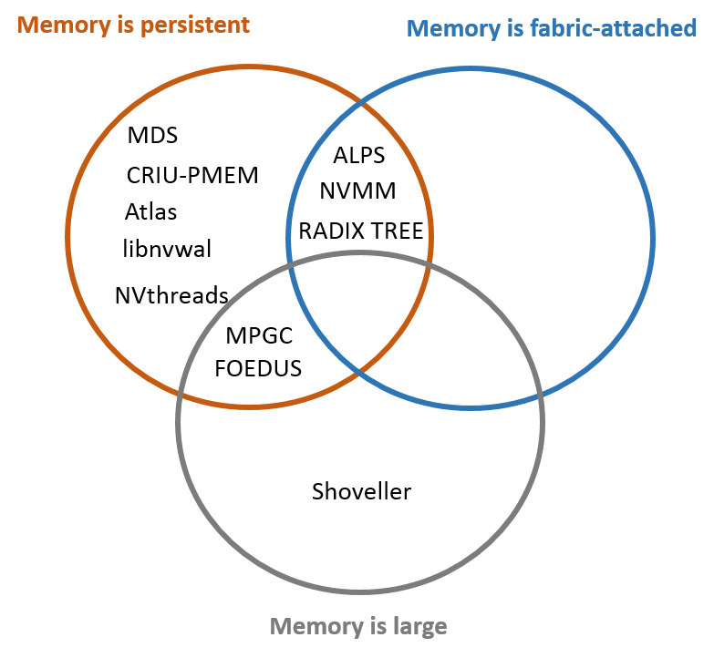

# mdc-toolkit

# Memory Driven Computing Toolkit

Author:  System Software Research Group, Hewlett Packard Labs

Contact: Daniel Feldman (daniel.feldman@hpe.com)

## Introduction

Hewlett Packard Labs has developed tools that enable
programmers to realize the full benefits of
[Memory Driven Computing](https://www.labs.hpe.com/next-next/mdc) (MDC) and persistent memory.  Current
HPE Superdome X machines feature massive, multi-terabyte memories and hundreds of
processor cores, and current [HPE servers feature persistent
memory](https://www.hpe.com/us/en/servers/persistent-memory.html)
implemented with NVDIMMs; future persistent memory products may employ
non-volatile memory (NVM) device technologies such as Memristor.
Fabric-attached memory (FAM) promises to scale far beyond today's
cache-coherent shared memory while preserving the convenience of
byte-addressable memory.

This repository provides a unified entry point to several Hewlett
Packard Labs tools and technologies related to MDC and persistent memory. 
We welcome comments and feedback. For help and support issues, please contact daniel.feldman@hpe.com.

## Contents

Here are entry points to documentation on the individual tools in the current release:

- [Guide for Newcomers](guide.md)
- [Guide to FAME](guide-FAME.md): Instructions on setting up [Fabric-Attached Memory Emulation (FAME)](https://github.com/FabricAttachedMemory)
- [Managed Data Structures (MDS)](README-MDS.md): Multi-process sharing of data structures in persistent memory
- [Multi-Process Garbage Collector (MPGC)](README-MPGC.md): Multi-process fault-tolerant automatic persistent memory management
- [ALPS](README-ALPS.md): Allocator Layer for Persistent Shared Memory
- [CRIU-PMEM](README-CRIU-PMEM.md): Checkpoint/Restore with Persistent Memory 
- [Shoveller](README-Shoveller.md): Scalable, memory-capacity-efficient Key-Value Store for very large-scale servers 
- [NVMM](README-NVMM.md): Non-Volatile Memory Manager (NVMM)
- [Radix Tree](README-Radix-Tree.md): Space-optimized trie library based on FAM atomics
- [libnvwal](README-libnvwal.md): Write-Ahead-Logging Library for Non-Volatile DIMMs
- [Atlas](README-Atlas.md): Programming persistent memory with crash resilience
- [FOEDUS](README-FOEDUS.md): Fast Optimistic Engine for Data Unification Services
- [NVthreads](README-NVthreads.md): Practical Persistence for Multi-threaded Applications

#### We plan to continue adding new tools to MDC-Toolkit in subsequent releases.
[Release Notes](release-notes.md)
